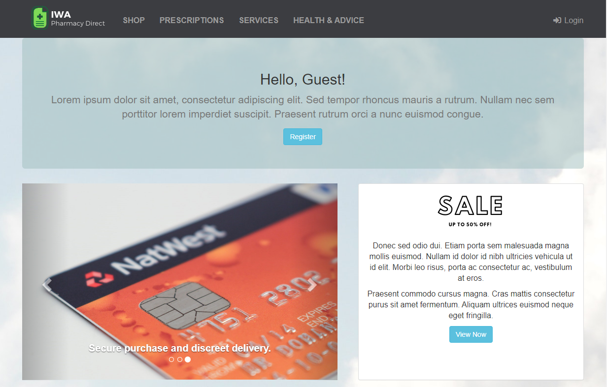

# IWA (Insecure Web App) Pharmacy Direct

#### Table of Contents

*   [Overview](#overview)
*   [Forking the Repository](#forking-the-repository)
*   [Building the Application](#building-the-application)
*   [Running the Application](#running-the-application)
*   [Application Security Testing Integrations](#application-security-testing-integrations)
    * [SAST using Fortify SCA command line](#static-analysis-using-fortify-sca-command-line)
    * [SAST using Fortify ScanCentral SAST](#static-analysis-using-fortify-scancentral-sast)
    * [Open Source Susceptibility Analysis using Sonatype Nexus IQ](#open-source-susceptibility-analysis-using-sonatype-nexus-iq)
    * [SAST using Fortify on Demand](#static-analysis-using-fortify-on-demand)
    * [DAST using Fortify WebInspect](#dynamic-analysis-using-fortify-webinspect)
    * [DAST using Fortify ScanCentral DAST](#dynamic-analysis-using-fortify-scancentral-dast)
    * [DAST using Fortify on Demand](#dynamic-analysis-using-fortify-on-demand)
    * [API Security Testing using Fortify WebInspect and Postman](#api-security-testing-using-fortify-webinspect-and-postman)
    * [API Security Testing using ScanCentral DAST](#api-security-testing-using-scancentral-dast-and-postman)
    * [FAST Using ScanCentral DAST and FAST proxy](#fast-using-scancentral-dast-and-fast-proxy)
*   [Build and Pipeline Integrations](#build-and-pipeline-integrations)
    * [Jenkins Pipeline](#jenkins-pipeline)
    * [GitHub Actions](#github-actions)
    * [Other Pipeline Tools](#other-pipeline-tools)
*   [Developing and Contributing](#developing-and-contributing)
*   [Licensing](#licensing)

## Notice

**For an "official" version of this application with additional pipeline integrations please visit [https://github.com/fortify/IWA-Java](https://github.com/fortify/IWA-Java).**

## Overview

_IWA (Insecure Web App) Pharmacy Direct_ is an example Java/Spring Web Application for use in **DevSecOps** scenarios and demonstrations.
It includes some examples of bad and insecure code - which can be found using static and dynamic application
security testing tools such as those provided by [Micro Focus Fortify](https://www.microfocus.com/en-us/cyberres/application-security).

One of the main aims of this project is to illustrate how security can be embedded early ("Shift-Left") and continuously ("CI/CD") in
the development lifecycle. Therefore, a number of examples of "integrations" to common CI/CD pipeline tools are provided.

The application is intended to provide the functionality of a typical "online pharmacy", including purchasing Products (medication)
and requesting Services (prescriptions, health checks etc). It has a modern-ish HTML front end (with some JavaScript) and a Swagger based API.

*Please note: the application should not be used in a production environment!*



An up-to-date version of the running application can be found at [https://iwa.onfortify.com](https://iwa.onfortify.com).

## Forking the Repository

In order to execute example scenarios for yourself, it is recommended that you "fork" a copy of this repository into
your own GitHub account. The process of "forking" is described in detail in the [GitHub documentation](https://docs.github.com/en/github/getting-started-with-github/fork-a-repo) - you can start the process by clicking on the "Fork" button at the top right.

## Building the Application

To build the application using Maven, execute the following from the command line:

```
mvn clean verify
```

You can also use Gradle if you prefer:

```
.\gradlew clean build
```


To build a WAR file for deployment to an application server such as [Apache Tomcat](http://tomcat.apache.org/)
execute the following:

```
mvn -Pwar clean package
```

This will create a WAR file (called `iwa.war`) in the `target` directory.

## Running the Application

There are a number of ways of running the application depending on the scenario(s) that you wish to execute.

### Development (IDE/command line)

To run (and test) locally in development mode, execute the following from the command line:

```
mvn spring-boot:run
```

or

```
.\gradlew bootRun
```

Then navigate to the URL: [http://localhost:8888](http://localhost:8888). You can carry out a number of
actions unauthenticated, but if you want to login you can do so as one of the following users:

- **user1@localhost.com/password**
- **user2@localhost.com/password**
  
There is also an administrative user:

- **admin@localhost.com/password**

Note if you login with `user2`, you will be subsequently asked for a Multi-Factor Authentication (MFA) code. You
can find this code by examining the console output.

### Deploy (Docker Image)

The JAR file can be built into a [Docker](https://www.docker.com/) image using the provided `Dockerfile` and the
following commands:

```
mvn -Pjar clean package
docker build -t iwa -f Dockerfile .
```

or on Windows:

```
mvn -Pjar clean package
docker build -t iwa -f Dockerfile.win .
```

This image can then be executed using the following commands:

```
docker run -d -p 8888:8888 iwa
```

There is also an example `docker-compose.yml` file that illustrates how to run the application with HTTPS/SSL using
[nginx](https://www.nginx.com/) and [certbot](https://certbot.eff.org/) - please note this is for reference only as it 
uses a "hard-coded" domain name.

## Application Security Testing Integrations

### Creating an environment (.env) file

Most of the following examples need environment and user specific credentials. These are loaded from a file called `.env`
in the project root directory. This file is not created by default (and should never be stored in source control). An example
with all of the possible settings for the following scenarios is illustrated below:

```aidl
# Application URL (locally)
APP_URL=http://localhost:8888
# Software Security Center
SSC_URL=http://[YOUR-SSC-SERVER]
SSC_USERNAME=admin
SSC_PASSWORD=password
SSC_AUTH_TOKEN=XXX
SSC_APP_NAME=IWAPharmacyDirect
SSC_APP_VER_NAME=main
# ScanCentral SAST/DAST
SCANCENTRAL_CTRL_URL=http://[YOUR-SCANCENTRAL-SERVER]/scancentral-ctrl
SCANCENTRAL_CTRL_TOKEN=XXX
SCANCENTRAL_POOL_ID=00000000-0000-0000-0000-000000000002
SCANCENTRAL_EMAIL=info@microfocus.com
SCANCENTRAL_DAST_API=http://[YOUR-SCANCENTRAL-DAST-SERVER]/api/
# ScanCentral FAST
FAST_EXE=C:\\Program Files\\Micro Focus WIRC Server\\Fast.exe
FAST_PORT=8087
FAST_PROXY=127.0.0.1:8087
# Fortify on Demand
FOD_API_URL=https://api.ams.fortify.com
FOD_API_KEY=XXXX
FOD_API_SECRET=YYYY
FOD_TENANT=[YOUR-TENANT]
FOD_USER=[YOUR-USERNAME]
FOD_PAT=XXXX
```

### SAST using Fortify SCA command line

There is an example PowerShell script [fortify-sast.ps1](bin/fortify-sast.ps1) that you can use to execute static application security testing
via [Fortify SCA](https://www.microfocus.com/en-us/products/static-code-analysis-sast/overview).

```aidl
.\bin\fortify-sast.ps1 -SkipSSC
```

This script runs a `sourceanalyzer` translation and scan on the project's source code. It creates a Fortify Project Results file called `IWAPharmacyDirect.fpr`
which you can open using the Fortify `auditworkbench` tool:

```aidl
auditworkbench.cmd .\IWAPharmacyDirect.fpr
```

It also creates a PDF report called `IWAPharmacyDirect.pdf` and optionally
uploads the results to [Fortify Software Security Center](https://www.microfocus.com/en-us/products/software-security-assurance-sdlc/overview) (SSC).

In order to upload to SSC you will need to have entries in the `.env` similar to the following:

```aidl
SSC_URL=http://localhost:8080/ssc
SSC_AUTH_TOKEN=28145aad-c40d-426d-942b-f6d6aec9c56f
SSC_APP_NAME=IWAPharmacyDirect
SSC_APP_VER_NAME=main
```

The `SSC_AUTH_TOKEN` entry should be set to the value of a 'CIToken' created in SSC _"Administration->Token Management"_.

### SAST using Fortify ScanCentral SAST

There is a PowerShell script [fortify-scancentral-sast.ps1](bin\fortify-scancentral-sast.ps1) that you can use to package
up the project and initiate a remote scan using Fortify ScanCentral SAST:

```aidl
.\bin\fortify-scancentral-sast.ps1
```

In order to use ScanCentral SAST you will need to have entries in the `.env` similar to the following:

```aidl
SSC_URL=http://localhost:8080/ssc
SSC_AUTH_TOKEN=6b16aa46-35d7-4ea6-98c1-8b780851fb37
SSC_APP_NAME=IWAPharmacyDirect
SSC_APP_VER_NAME=main
SCANCENTRAL_CTRL_URL=http://localhost:8080/scancentral-ctrl
SCANCENTRAL_CTRL_TOKEN=96846342-1349-4e36-b94f-11ed96b9a1e3
SCANCENTRAL_POOL_ID=00000000-0000-0000-0000-000000000002
SCANCENTRAL_EMAIL=test@test.com
```

The `SSC_AUTH_TOKEN` entry should be set to the value of a 'CIToken' created in SSC _"Administration->Token Management"_.

### SAST using Fortify on Demand

To execute a [Fortify on Demand](https://www.microfocus.com/en-us/products/application-security-testing/overview) SAST scan
you need to package and upload the source code to Fortify on Demand. To package the code into a Zip file for uploading
you can use the `scancentral` command utility as following:

```aidl
scancentral package -bt mvn -bf pom.xml --output fod.zip
```

You can then upload this manually using the Fortify on Demand UI or you can use the PowerShell script [fortify-fod.ps1](bin/fortify-fod.ps1) 
provided to upload the file and start a Fortify on Demand static scan as follows:

```PowerShell
.\bin\fortify-fod.ps1 -ZipFile '.\fod.zip' -ApplicationName 'IWA' -ReleaseName 'master' -Notes 'PowerShell initiated scan' `
    -FodApiUri 'https://api.emea.fortify.com' -FodApiKey 'FOD_ACCESS_KEY' -FodApiSecret 'FOD_SECRET_KEY'
``` 

where `FOD_ACCESS_KEY` and `FOD_SECRET_KEY` are the values of an API Key and Secret you have created in the Fortify on
Demand portal. This script makes use of the [PowerShellForFOD](https://github.com/fortify-community-plugins/PowerShellForFOD) 
PowerShell module.

### DAST using Fortify WebInspect

To carry out a WebInspect scan you should first "run" the application using one of the steps described above.
Then you can start a scan using the following command line:

```
"C:\Program Files\Fortify\Fortify WebInspect\WI.exe" -s ".\etc\IWA-UI-Dev-Settings.xml" -macro ".\etc\IWA-UI-Dev-Login.webmacro" -u "http://localhost:8888" -ep ".\IWA-DAST.fpr" -ps 1008
```

This will start a scan using the Default Settings and Login Macro files provided in the `etc` directory. It assumes
the application is running on "localhost:8888". It will run a "Critical and High Priority" scan using the policy with id 1008. 
Once completed you can open the WebInspect "Desktop Client" and navigate to the scan created for this execution. An FPR file
called `IWA-DAST.fpr` will also be available - you can open it with `auditworkbench` (or generate a
PDF report from using `ReportGenerator`). You could also upload it to Fortify SSC or Fortify on Demand.

There is an example PowerShell script file [fortify-webinspect.ps1](bin\fortify-webinspect.ps1) that you can run to 
execute the scan and upload the results to SSC:

```aidl
.\bin\fortify-webinspect.ps1
```

### DAST using Fortify ScanCentral DAST

To carry out a ScanCentral DAST scan you should first "run" the application using one of the steps described above.
Then you can start a scan using the provided PowerShell script [fortify-scancentral-dast.ps1](bin\fortify-scancentral-dast.ps1).
It can be invoked via the following from a PowerShell prompt:

```PowerShell
.\bin\fortify-scancentral-dast.ps1 -ApiUri 'SCANCENTRAL_DAST_API' -Username 'SSC_USERNAME' -Password 'SSC_PASSWORD' `
    -CiCdToken 'CICD_TOKEN_ID'
``` 

where `SCANCENTRAL_DAST_API` is the URL of the ScanCentral DAST API configured in SSC and
`SSC_USERNAME` and `SSC_PASSWORD` are the login credentials of a Software Security Center user who is permitted to
run scans. Finally, `CICD_TOKEN_ID` is the "CICD identifier" of the "Scan Settings" you have previously created from the UI.

### DAST using Fortify on Demand

You can invoke a Fortify on Demand dynamic scan using the [PowerShellForFOD](https://github.com/fortify-community-plugins/PowerShellForFOD) PowerShell module.
For examples on how to achieve this see [here](https://github.com/fortify-community-plugins/PowerShellForFOD/blob/master/USAGE.md#starting-a-dynamic-scan).

### API Security Testing using Fortify WebInspect and Postman

The IWA application includes a fully documented [Swagger](https://swagger.io/solutions/getting-started-with-oas/) based 
API which you can browse to at 
[http://localhost:8888/swagger-ui/index.html?configUrl=/v3/api-docs/swagger-config](http://localhost:8888/swagger-ui/index.html?configUrl=/v3/api-docs/swagger-config).
You can carry out security testing of this API using Fortify WebInspect or ScanCentral DAST. A [Postman](https://www.postman.com/downloads/) 
collection is provided to help in this. You can exercise the collection using [newman](https://github.com/postmanlabs/newman). For example from a PowerShell
command prompt on Windows:

```PowerShell
newman run .\etc\IWA-API-Dev-Auth.postman_collection.json --environment .\etc\IWA-API-Dev.postman_environment.json --export-environment .\etc\IWA-API-Dev.postman_environment.json
newman run .\etc\IWA-API-Dev-Workflow.postman_collection.json --environment .\etc\IWA-API-Dev.postman_environment.json
```

In order to use this collection with WebInspect you will need to make sure newman is on the path and then you can run:

```PowerShell
& "C:\Program Files\Fortify\Fortify WebInspect\WI.exe" -pwc .\etc\IWA-API-Dev-Workflow.postman_collection.json -pec .\etc\IWA-API-Dev.postman_environment.json -ep ".\IWA-API.fpr"
```

### API Security Testing using ScanCentral DAST and Postman

You can also import the Postman collections into ScanCentral DAST and run the resultant setup using the [fortify-scancentral-dast.ps1](bin\fortify-scancentral-dast.ps1)
script and the relevant CICD Identifier. You will need to use the following

Response Token:
```aidl
"accessToken"\s*:\s*"(?<BearerTokenValue>[-a-zA-Z0-9._~+/]+?=*)"
```
Request Token:
```aidl
Authorization:\sBearer\s(?<{0}>[^\r\n]*)\r?\n
```
Logout Condition:
```aidl
[STATUSCODE]401
```

### FAST Using ScanCentral DAST and FAST proxy

_The Fortify FAST Proxy allows you to capture traffic from an automated test run and then use the traffic
as a workflow for a ScanCentral DAST execution. In order to carry out the example here you will need
to have installed `WIRCServerSetup64-ProxyOnly.msi` which is available in the `Dynamic_Addons.zip` of the
ScanCentral DAST installation media._

There is an example [Selenium](https://www.selenium.dev/) Python test script provided [test_add_to_cart.py](`.\src\test\python\test_add_to_cart.py`) that can be used to execute a simple 
functional test of the running application. There are also a couple of PowerShell scripts [start_fast_proxy.ps1](`.\bin\start_fast_proxy.ps1`) and [stop_fast_proxy.ps1](`.\bin\stop_fast_proxy.ps1`) that can
be used to start/stop the FAST Proxy. In order to use these scripts you will need to have entries in the `.env` file similar to the following:

```aidl
APP_URL=https://iwa.onfortify.com
SSC_AUTH_TOKEN_BASE64=MmYyMTA5MzYtN2Q5Ny00NmM1LWI5NTUtYThkZWI2YmJlMDUy
SSCANCENTRAL_DAST_API=http://localhost:5001/api/
SCANCENTRAL_DAST_CICD_IDENTIFIER=c3c3df60-de68-45b8-89c0-4c07b53392e7
FAST_EXE=C:\\Program Files\\Micro Focus WIRC Server\\Fast.exe
FAST_PORT=8087
FAST_PROXY=127.0.0.1:8087
CHROME_WEBDRIVER_PATH=C:/Tools/selenium/chromedriver.exe
```

The `SSC_AUTH_TOKEN_BASE64` is the (first) encoded token shown in SSC not the (second) decoded token. The `CHROME_WEBDRIVER_PATH`
should be set to a compatible version for your Chrome browser as downloaded from [here](https://chromedriver.chromium.org/downloads).

You will also need to have installed the `Selenium`, `PyTest` and `python-dotenv` Python modules:

```
pip install selenium
pip install pytest
pip install python-dotenv
```
Make sure the application is running and then execute the following in a terminal window:

```aidl
powershell bin\start_fast_proxy.ps1
```

Then in another terminal window execute the following:

```aidl
pytest
powershell bin\stop_fast_proxy.ps1
```

The FAST executable from the first terminal should terminate and then a scan execute in your
ScanCentral DAST environment.

## Build and Pipeline Integrations

### Jenkins

If you are using [Jenkins](https://jenkins.io/), a comprehensive `Jenkinsfile` is provided to automate all of the typical
steps of a typical DevSecOps Continuous Delivery (CD) process. The example makes use of Fortify ScanCentral SAST/DAST and
Sonatype Nexus IQ for Software Composition Analysis.

To make use of the `Jenkinsfile` create a new Jenkins *Pipeline* Job and in the *Pipeline*
section select `Pipeline script from SCM` and enter the details of a forked version of this GitHub repository.

The first run of the pipeline should be treated as a "setup" step as it will
create some *Job Parameters* which you can then select to determine which features
you want to enable in the pipeline.

You will need to have installed and configured the [Fortify](https://plugins.jenkins.io/fortify/) Jenkins plugins.

There is lots of documentation in the `Jenkinsfile` itself so please examine it to see what else
you will need to do for a successful invocation.

### GitHub Actions

This repository includes a [GitHub Actions](https://github.com/features/actions) example
[workflow](.github/workflows/DevSecOps.yml) that
automates the build of the application and scans the code using either
[Fortify on Demand](https://www.microfocus.com/en-us/products/application-security-testing) or [Fortify ScanCentral](https://www.microfocus.com/en-us/cyberres/application-security/static-code-analyzer) for SAST.

### Other Pipeline Tools

For integrations with other pipeline tools please see [https://github.com/fortify/IWA-Java](https://github.com/fortify/IWA-Java).

## Developing and Contributing

Please see the [Contribution Guide](CONTRIBUTING.md) for information on how to develop and contribute.

If you have any problems, please consult [GitHub Issues](https://github.com/fortify-presales/IWAPharmacyDirect/issues) to see if it has already been discussed.

## Licensing

This application is made available under the [GNU General Public License V3](LICENSE)
